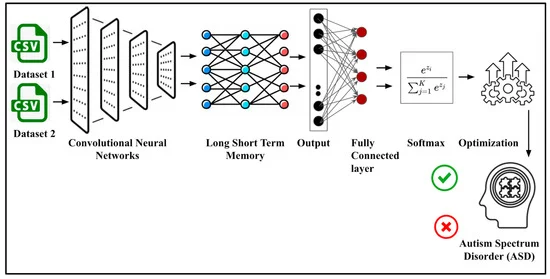
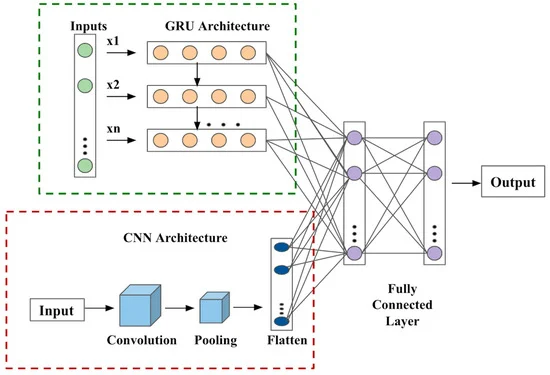
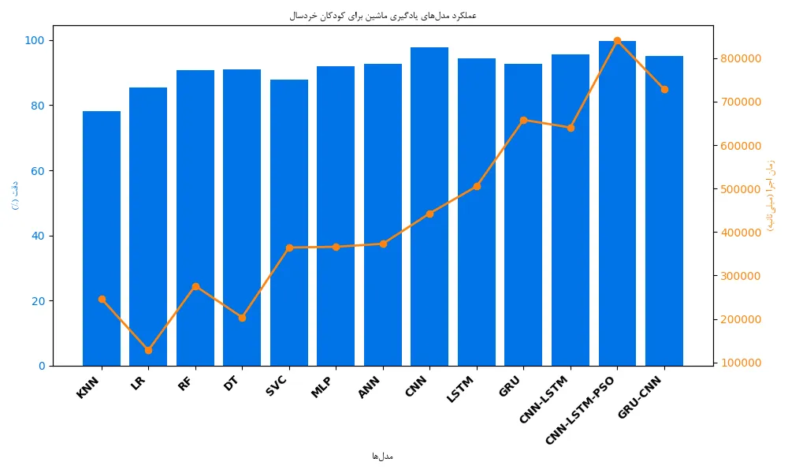
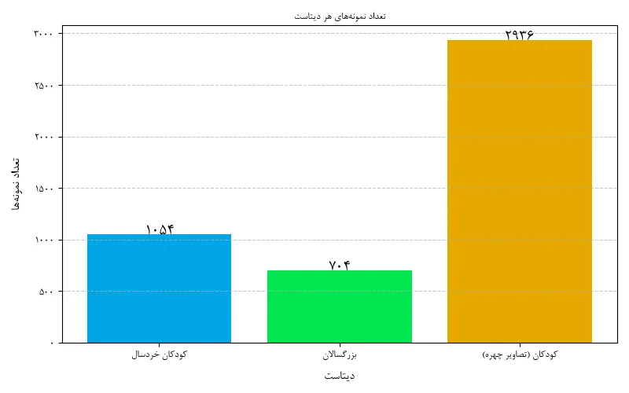
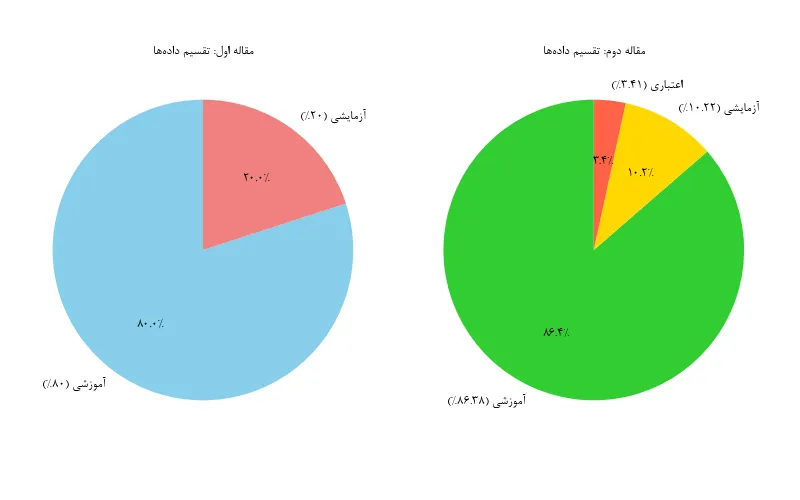

بسم الله الرحمن الرحیم

  
<h1 style="text-align: center; font-weight: 900; font-size: 24pt;">تشخیص طیف اختلال اوتیسم براساس ویژگی‌های رفتاری و چهره‌ای با کمک هوش‌مصنوعی</h1>

  

  

    
استاد راهنما:

    
دکتر سید محمد نوربخش رضائی

     
    
پژوهشگران:

    
علی هاشمی

    
علی ابراهیمیان

  

## مقدمه

اختلال طیف اوتیسم Autism Spectrum Disorder (ASD) یکی از اختلالات رشدی است که به دلیل ناهنجاری‌های نوروبیولوژیکی بروز می‌کند و می‌تواند تأثیرات قابل توجهی بر مهارت‌های اجتماعی، توانایی‌های ارتباطی، یادگیری و رفتار افراد داشته باشد. این اختلال معمولاً در دو سال نخست زندگی ظاهر می‌شود و به دلیل تنوع در شدت و نوع علائم، اصطلاح "طیف" به آن اطلاق می‌شود. بر اساس آمار سازمان بهداشت جهانی، اوتیسم حدود 1 نفر از هر 160 نفر در سراسر جهان را تحت تأثیر قرار می‌دهد که معادل 2 درصد از جمعیت جهانی است. در ایالات متحده، شیوع اوتیسم به‌طور خاص نگران‌کننده است، به‌طوری که آمارها نشان می‌دهند از هر 36 کودک، یک نفر به این اختلال مبتلا است.

افراد مبتلا به اوتیسم معمولاً در حفظ تماس چشمی، درک احساسات دیگران و تطبیق با موقعیت‌های اجتماعی با چالش مواجه می‌شوند و رفتارها و علایق آن‌ها ممکن است محدود و تکراری باشد. علاوه بر این، ویژگی‌های خاصی در نحوه تفکر، حرکت و توجه این افراد مشاهده می‌شود. اگرچه دلیل قطعی بروز اوتیسم هنوز به‌طور کامل شناسایی نشده است، شواهد نشان می‌دهند که عوامل ژنتیکی و محیطی نقش مهمی در بروز این اختلال دارند. برای نمونه، تحقیقات حاکی از آن است که میزان بافت‌های مغزی در مخچه افراد مبتلا به اوتیسم به‌طور قابل توجهی کمتر است.

تشخیص اوتیسم معمولاً در دو مرحله انجام می‌شود: نخست، غربالگری اولیه برای شناسایی تأخیرهای رشدی و سپس ارزیابی‌های تکمیلی نظیر معاینات عصبی، آزمون‌های شناختی، مشاهده رفتار، بررسی مهارت‌های زبانی و آزمایش شنوایی. شناسایی و مداخله زودهنگام نقش کلیدی در کاهش شدت علائم اوتیسم دارد و می‌تواند به بهبود مشکلاتی نظیر پرخاشگری، بیش‌فعالی، کمبود توجه، اضطراب و افسردگی کمک کند. این مداخلات همچنین زمینه را برای رشد مهارت‌های لازم جهت یک زندگی مستقل در آینده فراهم می‌کنند.

با توجه به روند افزایشی شیوع اوتیسم، که بر اساس آمار سال 2022 در ایالات متحده از هر 44 کودک یک نفر به این اختلال مبتلا است، توجه به غربالگری و درمان به‌موقع این اختلال اهمیت روزافزونی پیدا کرده است. از سوی دیگر، پیشرفت‌های فناوری به‌ویژه در حوزه یادگیری ماشین (Machine Learning)، نویدبخش تغییرات بزرگی در فرآیند تشخیص اوتیسم بوده است. الگوریتم‌های یادگیری ماشین قادرند داده‌های حجیم را با سرعت و دقت بیشتری نسبت به انسان تحلیل کنند. این ابزارها می‌توانند ویژگی‌های متعدد افراد مبتلا به اوتیسم را بررسی کرده و ویژگی‌های مشترک میان آن‌ها را استخراج کنند. این قابلیت نه تنها به تشخیص سریع‌تر و دقیق‌تر اوتیسم کمک می‌کند، بلکه امکان شروع مداخلات درمانی در مراحل ابتدایی را نیز فراهم می‌آورد.

---

## بررسی منابع (مرور مقالات)

### (۱) ***Autism Screening in Toddlers and Adults Using Deep Learning and Fair AI Techniques***

### ۱.۱ مجموعه داده‌ها

دو مجموعه داده مستقل برای بررسی غربالگری اوتیسم استفاده شده است:  

- **مجموعه داده کودکان خردسال**: شامل ۱۰۵۴ ردیف و ۱۹ ستون.  
- **مجموعه داده بزرگسالان**: شامل ۷۰۴ ردیف و ۲۱ ستون.  

### ۱.۲ پرسشنامه‌ها

- **کودکان خردسال**: داده‌ها از پرسشنامه‌ای شامل ارزیابی ۱۰ ویژگی رفتاری با پاسخ‌های چند گزینه‌ای ("همیشه"، "معمولاً"، "گاهی اوقات"، "هرگز") جمع‌آوری شده‌اند. این پاسخ‌ها به مقادیر باینری (۰ و ۱) نگاشت شده و امتیاز بیشتر از ۳ نشان‌دهنده احتمال صفات اوتیسمی است.  
- **بزرگسالان**: پرسشنامه شامل ۱۰ سوال (A1–A10) است که ویژگی‌های رفتاری خاصی را ارزیابی می‌کند.  

### ۱.۳ روش‌شناسی

در این مطالعه از **شبکه‌های عصبی کانولوشنی (CNN)** برای شناسایی الگوها در داده‌ها استفاده شده است. معماری این شبکه شامل لایه‌های مختلفی مانند **لایه کانولوشنی**، **لایه ماکس پولینگ** و **لایه کاملاً متصل** است که هر کدام وظیفه خاصی را انجام می‌دهند.  
لایه کانولوشنی شامل فیلترهایی است که با اعمال عملیات کانولوشن، نقشه‌های ویژگی (Feature Maps) را از ویژگی‌های ورودی تولید می‌کنند. معادله این عملیات به صورت زیر تعریف شده است:  
$$ f = V(x * w_f + y_f) $$
که در آن:

- \( f \): نقشه ویژگی  
- \( w_f \): وزن‌های کرنل  
- \( x \): ویژگی‌های ورودی  
- \( y_f \): بایاس  
- \( V \): تابع فعال‌سازی  
- \( * \): عملیات کانولوشن  

**شبکه حافظه بلندمدت کوتاه‌مدت (LSTM)** برای حل مشکل محو یا انفجار گرادیان در شبکه‌های عصبی بازگشتی معرفی شده است. این شبکه شامل گیت‌های ورودی، خروجی و فراموشی است که اطلاعات مهم را از طریق ضرب نقطه‌ای و تابع سیگموید مدیریت می‌کنند.

<figure>

<figcaption>تصویر(۱) نمایش معماری سیستم LSTM.</figcaption>
</figure>

### ۱.۴ معماری پیشنهادی

معماری پیشنهادی شامل **CNN** و **LSTM** است که با استفاده از **بهینه‌سازی ازدحام ذرات (PSO)** برای تشخیص دقیق اوتیسم طراحی شده است.  

- CNN و LSTM ویژگی‌های پیچیده و الگوهای موجود در داده‌ها را استخراج می‌کنند.
- PSO برای بهینه‌سازی نتایج استفاده شده و عملکرد مدل را بهبود می‌بخشد.  
- مکانیزم **Dropout** برای جلوگیری از بیش‌برازش و بهبود توانایی تعمیم مدل اعمال شده است.  

لایه کاملاً متصل خروجی نهایی را با استفاده از تابع فعال‌سازی **Softmax** ارائه می‌دهد. الگوریتم PSO تعداد لایه‌های CNN و LSTM، تعداد واحدها، و تعداد اپوک‌ها را بهینه می‌کند. فضای جستجو با مقادیر تصادفی برای لایه‌ها، فیلترها و اپوک‌ها مقداردهی اولیه می‌شود.  
**تابع برازش**، که به صورت ریشه میانگین مربعات خطا (RMSE) تعریف شده است، برای بهینه‌سازی مقادیر ابرپارامترها استفاده می‌شود.

### ۱.۵ معماری هیبریدی GRU–CNN

در این معماری، شبکه‌های GRU و CNN با یکدیگر ترکیب شده‌اند. مشکلاتی مانند محو یا انفجار گرادیان و حافظه کوتاه‌مدت با استفاده از مکانیزم گیت‌ها در GRU مدیریت می‌شود.  
<figure>

<figcaption>تصویر(۲) نمایش معماری سیستم GRU.</figcaption>
</figure>
معماری شامل:

- **5 بلوک کانولوشنی**: هر بلوک شامل دو لایه کانولوشنی و یک لایه ماکس پولینگ است.  
- **1 بلوک GRU**: وابستگی‌های طولانی‌مدت را با کمک گیت‌های حافظه مدیریت می‌کند.  
- **1 بلوک کاملاً متصل**: شامل لایه‌های کانولوشنی با تابع Softmax برای طبقه‌بندی.

### ۱.۶ وابستگی ها  

- از **پایتون ۳.۸** همراه با کتابخانه‌هایی مانند TensorFlow-GPU، Numpy، Pandas، و Scikit-Learn برای تحلیل داده‌ها استفاده شده است.  
- مدل‌ها با **بهینه‌ساز Adam** و اندازه دسته‌ای (Batch Size) برابر ۱۰ آموزش داده شده‌اند.  
- داده‌ها پس از پیش‌پردازش به نسبت ۸۰-۲۰ به داده‌های آموزشی و تست تقسیم شده‌اند.  

### ۱.۷ معیارهای ارزیابی  

1. **دقت (Accuracy)**: نسبت پیش‌بینی‌های صحیح به کل پیش‌بینی‌ها.

$$\text{Accuracy} = \frac{\text{TP} + \text{TN}}{\text{TP} + \text{TN} + \text{FP} + \text{FN}}$$

2. **دقت مثبت (Precision)**: نسبت پیش‌بینی‌های مثبت صحیح به کل پیش‌بینی‌های مثبت.

$$\text{Precision} = \frac{\text{TP}}{\text{FP}+\text{TP}}$$

3. **بازخوانی (Recall)**: توانایی مدل در شناسایی موارد مثبت واقعی.

$$\text{Recall} = \frac{\text{TP}}{\text{FN} + \text{TP}}$$

4. **F1-Score**: میانگین هارمونیک دقت و بازخوانی.  

$$F1 = \frac{\text{Precision} \times \text{Recal} \times 2}{\text{Precision} + \text{Recall}}$$

### ۱.۸ نتایج  

#### ۱.۸.۱ عملکرد مدل‌های یادگیری ماشین برای کودکان خردسال  

| مدل‌ها | دقت (%) | دقت مثبت | بازخوانی | F1-Score | زمان اجرا (میلی‌ثانیه) |  
| -------- | ---------- | ----------- | ---------- | ---------- | ------------------------- |  
| KNN    | 78.12    | 0.67      | 0.72     | 0.87     | 246,464                 |  
| LR     | 85.38    | 0.81      | 0.88     | 0.88     | 127,787                 |  
| RF     | 90.88    | 0.90      | 0.77     | 0.82     | 276,126                 |  
| DT     | 91.02    | 0.88      | 0.82     | 0.84     | 203,664                 |  
| SVC    | 87.77    | 0.84      | 0.89     | 0.74     | 364,248                 |  
| MLP    | 91.90    | 0.88      | 0.78     | 0.80     | 366,024                 |  
| ANN    | 92.68    | 0.89      | 0.81     | 0.81     | 372,866                 |  
| CNN    | 97.78    | 0.94      | 0.86     | 0.89     | 442,886                 |  
| LSTM   | 94.49    | 0.93      | 0.92     | 0.90     | 504,994                 |  
| GRU    | 92.78    | 0.90      | 0.88     | 0.87     | 658,021                 |  
| CNN–LSTM | 95.66  | 0.91      | 0.92     | 0.92     | 640,482                 |  
| **CNN–LSTM–PSO** | **99.64** | **0.96** | **0.94** | **0.91** | **840,599**         |  
| GRU–CNN | 95.02   | 0.92      | 0.90     | 0.88     | 728,894                 |  

<figure>

<figcaption>تصویر(۳) نمایش مقایسه کارایی مدل ها برای کودکان خردسال.</figcaption>
</figure>

#### ۱.۸.۲ عملکرد مدل‌های یادگیری ماشین برای بزرگسالان  

| مدل‌ها | دقت (%) | دقت مثبت | بازخوانی | F1-Score | زمان اجرا (میلی‌ثانیه) |  
| -------- | ---------- | ----------- | ---------- | ---------- | -------------------------  |  
| KNN    | 90.08    | 0.78      | 0.77     | 0.82     | 266,848                 |  
| LR     | 93.05    | 0.90      | 0.84     | 0.88     | 208,664                 |  
| RF     | 94.68    | 0.91      | 0.88     | 0.88     | 382,677                 |  
| DT     | 92.62    | 0.89      | 0.82     | 0.84     | 300,116                 |  
| SVC    | 92.36    | 0.90      | 0.88     | 0.90     | 480,248                 |  
| MLP    | 95.04    | 0.92      | 0.82     | 0.86     | 521,436                 |  
| ANN    | 95.83    | 0.89      | 0.89     | 0.88     | 588,644                 |  
| CNN    | 96.81    | 0.92      | 0.93     | 0.91     | 682,042                 |  
| LSTM   | 93.44    | 0.85      | 0.81     | 0.83     | 654,883                 |  
| GRU    | 96.04    | 0.90      | 0.92     | 0.94     | 778,899                 |  
| CNN–LSTM | 96.66  | 0.92      | 0.91     | 0.94     | 729,890                 |  
| **CNN–LSTM–PSO** | **98.89** | **0.94** | **0.91** | **0.93** | **900,048**         |  
| GRU–CNN | 94.02   | 0.90      | 0.90     | 0.88     | 814,766                 |  

<figure>

<figcaption>تصویر(۴) نمایش مقایسه کارایی مدل ها برای بزرگسالان.</figcaption>
</figure>

### ۱.۹ نتیجه‌گیری

بین ۱۳ مدل یادگیری ماشین، مدل **CNN–LSTM–PSO** بهترین عملکرد را در هر دو مجموعه داده کودکان و بزرگسالان نشان داده است. این مدل با دقت ۹۹.۶۴٪ برای کودکان و ۹۸.۸۹٪ برای بزرگسالان، نسبت به سایر مدل‌ها برتری داشته است. با وجود پیچیدگی بالا و زمان آموزش طولانی، عملکرد برتر این مدل آن را به گزینه‌ای مناسب برای تشخیص اوتیسم تبدیل کرده است.

---

### (۲) ***Diagnosis of Autism in Children Using Deep Learning Techniques by Analyzing Facial Features***

### ۲.۱ روش‌شناسی

هدف این مطالعه استفاده از چارچوب مبتنی بر یادگیری انتقالی برای شناسایی ویژگی‌های چهره‌ای افراد مبتلا به اوتیسم بود تا بتوان اختلال طیف اوتیسم (ASD) را در سال‌های ابتدایی زندگی کودکان شناسایی کرد. برای این کار، از مدل‌های یادگیری عمیق پیش‌ساخته استفاده شد تا ویژگی‌هایی استخراج شوند که شناسایی آن‌ها از طریق بررسی بصری دشوار است. سپس این ویژگی‌ها از طریق لایه‌های مختلف پردازش شده و لایه نهایی برای تشخیص ASD تنظیم گردید.

### ۲.۲ معماری سیستم

شکل جریان کار در یک نمودار بلوکی نمایش داده می‌شود.

<figure>

<figcaption>تصویر(۵) نمایش معماری سیستم.</figcaption>
</figure>

#### ۲.۲.۱ جزئیات داده‌ها

برای دستیابی به عملکرد بهینه در مدل‌های یادگیری عمیق، استفاده از یک مجموعه داده بزرگ برای آموزش در سناریوهای مختلف ضروری است. این امر به بهبود دقت مدل‌ها کمک می‌کند. مدل‌های پیشنهادی این مطالعه از مجموعه داده‌های کودکان اوتیسمی که در مخزن Kaggle موجود است، استفاده کردند. سن کودکان در این مجموعه داده بین ۲ تا ۱۴ سال بود و بیشتر آن‌ها بین ۲ تا ۸ سال سن داشتند. این مجموعه داده شامل تصاویر ۲D RGB بود و کلاس‌های اوتیسمی و کنترل طبیعی (NC) به‌طور مساوی نمایانده شدند. نسبت جنسیتی مرد به زن در مجموعه داده تقریباً ۳:۱ بود.

مجموعه داده به سه گروه تقسیم شد:

- مجموعه آموزش: ۲۵۳۶ تصویر (۸۶.۳۸%)
- مجموعه آزمون: ۳۰۰ تصویر (۱۰.۲۲%)
- مجموعه اعتبارسنجی: ۱۰۰ تصویر (۳.۴۱%)

هیچ تاریخچه بالینی درباره کودکان در مجموعه داده موجود نیست.

### ۲.۳ افزایش داده‌ها

برای بهبود کارایی آموزش، تصاویر از تکنیک‌های افزایش داده مانند چرخش، وارونگی افقی، بزرگ‌نمایی و جابجایی ارتفاع و عرض استفاده می‌کنند. این تکنیک‌ها منجر به تولید مجموعه داده‌های افزوده برای مجموعه‌های آموزش و اعتبارسنجی شدند. همچنین، تصاویر باید به ابعاد ۲۲۷ × ۲۲۷ × ۳ تغییر اندازه می‌یافتند تا با معماری مشخص شده سازگار شوند.

### ۲.۴ مدل‌های یادگیری انتقالی برای استخراج ویژگی‌ها

این مطالعه از سه مدل یادگیری عمیق پیش‌ساخته که از شبکه‌های عصبی کانولوشنی (CNN) استفاده می‌کنند، استفاده کرده است: VGG16، VGG19، و EfficientNetB0. این انتخاب‌ها بر اساس عملکرد برجسته این مدل‌ها در ادبیات موجود بوده است.

#### ۲.۴.۱ VGG16

  VGG16 یکی از معماری‌های معروف شبکه‌های عصبی کانولوشنی است که برای طبقه‌بندی تصاویر شناخته شده است. این مدل شامل ۱۶ لایه است که ۱۳ لایه کانولوشنی و ۳ لایه کاملاً متصل دارد.

#### ۲.۴.۲ VGG19

  VGG19 یک مدل شبکه عصبی کانولوشنی است که از فیلترهای کانولوشنی ۳×۳ کوچک استفاده می‌کند. این شبکه دارای ۱۹ لایه وزنی است که عملکرد پیشرفته‌ای در شناسایی و طبقه‌بندی تصاویر دارد.

#### ۲.۴.۳ EfficientNetB0

  EfficientNetB0 یک مدل عصبی است که برای تعادل بین دقت و کارایی محاسباتی طراحی شده است. این مدل از مقیاس‌گذاری ترکیبی برای افزایش دقت استفاده می‌کند و به‌ویژه برای کار با منابع محدود بهینه شده است.

### ۲.۵ نتایج

#### ۲.۵.۱ تغییرات معماری

مدل سفارشی با استفاده از سه مدل پیش‌آموزش‌شده (VGG16، VGG19 و EfficientNetB0) ساخته شد و بهینه‌سازی‌هایی برای سازگاری با مجموعه داده‌های اوتیسم انجام شد. این مدل شامل ۹ لایه اضافی بود که شامل لایه‌های حداکثر تجمع جهانی، لایه‌های متراکم و لایه‌های Drop-out بود.

#### ۲.۵.۲ تنظیم هایپرپارامترها

برای ارزیابی عملکرد مدل‌ها از هایپرپارامترهای مختلف استفاده شد. دقت و مساحت زیر منحنی (AUC) مدل‌ها با استفاده از ترکیب‌های مختلف هایپرپارامترها ارزیابی شد. جدول ۱ دقت اعتبارسنجی برای بهینه‌سازها را نشان می‌دهد:

| مدل         | Adamax دقت | Adamax AUC | Adam دقت | Adam AUC | Adagrad دقت | Adagrad AUC |
| ------------- | ------------ | ------------ | ---------- | ---------- | ------------- | ------------- |
| VGG19       | 50.00%     | 50.16%     | 51.44%   | 50.00%   | 87.66%      | 93.06%      |
| VGG16       | 52.74%     | 54.16%     | 57.89%   | 60.29%   | 84.67%      | 90.73%      |
| EfficientNetB0 | 88.33%   | 95.44%     | 87.66%   | 94.32%   | 82.66%      | 88.68%      |

#### ۲.۵.۳ تنظیم نرخ یادگیری

برای بهینه‌سازی عملکرد، نرخ‌های یادگیری مختلف آزمایش شدند. نتایج مربوط به تأثیر نرخ‌های یادگیری بر دقت و AUC مدل‌ها در جدول ۲ آمده است:

| مدل             | نرخ یادگیری 0.01 | نرخ یادگیری 0.001 | نرخ یادگیری 0.0001 |
|-----------------|------------------|--------------------|---------------------|
| VGG19           | دقت: 74.00%  | دقت: 50.74%   | دقت: 84.66%         |
| VGG16           | دقت: 76.22%  | دقت: 52.74%   | دقت: 80.05%         |
| EfficientNetB0  | دقت: 87.37%  | دقت: 88.33%   | دقت: 87.9%          |

<figure>

<figcaption>تصویر(۶) نمایش مقایسه دقت مدل‌ها با نرخ‌های یادگیری مختلف.</figcaption>
</figure>

### ۲.۶ نتیجه‌گیری‌ها

هدف اصلی این مطالعه شناسایی بهترین مدل انتقال یادگیری برای طبقه‌بندی اختلال طیف اوتیسم (ASD) بود. نتایج نشان داد که مدل **EfficientNetB0** با بهینه‌ساز **Adamax** و نرخ یادگیری 0.001 بهترین عملکرد را ارائه داد. این مدل دقت ۸۸.۳۳٪ و AUC برابر با ۹۵.۴۴٪ را به‌دست آورد که به‌طور قابل توجهی از مدل‌های VGG16 و VGG19 پیشی گرفت.

---

## تحلیل مقایسه‌ای

| **معیار**                   | **مقاله ۱: *Autism Screening in Toddlers and Adults Using Deep Learning and Fair AI Techniques*** | **مقاله ۲: *Diagnosis of Autism in Children Using Deep Learning Techniques by Analyzing Facial Features*** |
| ----------------------------- | -------------------------------------------------------------------------------------------------- | ---------------------------------------------------------------------------------------------------------- |
| **نوع داده‌ها**             | داده‌های رفتاری شامل پاسخ‌های پرسشنامه‌ای.                                                     | تصاویر چهره کودکان اوتیسمی و کنترل طبیعی (NC).                                                         |
| **مدل‌های استفاده‌شده**     | 13 مدل مختلف یادگیری ماشین و عمیق شامل CNN، LSTM، GRU، CNN-LSTM، و CNN-LSTM-PSO.                 | مدل‌های انتقال یادگیری شامل VGG16، VGG19، و EfficientNetB0.                                            |
| **بالاترین دقت مدل‌ها**     | مدل CNN-LSTM-PSO با دقت 99.64% برای کودکان و 98.89% برای بزرگسالان.                            | EfficientNetB0 با دقت 88.33% و AUC برابر با 95.44%.                                                     |
| **روش‌های ارزیابی**         | دقت (Accuracy)، دقت مثبت (Precision)، بازخوانی (Recall)، و F1-Score.                            | دقت (Accuracy) و مساحت زیر منحنی (AUC).                                                                |
| **پیش‌پردازش داده‌ها**      | نگاشت پاسخ‌های پرسشنامه به مقادیر باینری (۰ و ۱).                                               | افزایش داده‌ها از طریق تکنیک‌هایی مانند چرخش، وارونگی افقی، و تغییر اندازه تصاویر.                      |
| **مزایا**                   | دقت بالا و ارزیابی جامع با استفاده از مدل‌های مختلف.                                            | تمرکز بر ویژگی‌های چهره و استفاده از یادگیری انتقالی برای بهبود تشخیص در کودکان.                       |
| **معایب**                   | وابستگی به پاسخ‌های پرسشنامه‌ای که ممکن است تحت تأثیر عوامل مختلف قرار گیرد.                   | نیاز به داده‌های تصویری با کیفیت بالا و زمان پردازش طولانی‌تر.                                         |
| **نتیجه‌گیری کلی**          | برای غربالگری رفتارهای اوتیسمی در کودکان و بزرگسالان مناسب است.                                | رویکرد مناسبی برای شناسایی زودهنگام اختلال طیف اوتیسم در کودکان از طریق تصاویر چهره ارائه می‌دهد.      |  

### تحلیل کلی

- مقاله اول در شناسایی رفتارهای اوتیسمی عملکرد بهتری از نظر دقت و پوشش گسترده داده‌ها داشت.  
- مقاله دوم، با وجود دقت پایین‌تر، بر تحلیل چهره و یادگیری انتقالی متمرکز بوده و برای کاربردهای تصویری مناسب‌تر است.  
- ترکیب این دو رویکرد می‌تواند در آینده برای تشخیص جامع اوتیسم استفاده شود.

---

## **دیتاست‌های استفاده‌شده**  

### مقاله اول: Autism Screening in Toddlers and Adults Using Deep Learning and Fair AI Techniques  

- **ویژگی‌های کلیدی دیتاست:**

  - شامل دو مجموعه داده:  
    - **کودکان خردسال:** ۱۰۵۴ ردیف و ۱۹ ستون.  
    - **بزرگسالان:** ۷۰۴ ردیف و ۲۱ ستون.  
  - داده‌ها از پاسخ‌های پرسشنامه‌ای شامل ارزیابی ویژگی‌های رفتاری جمع‌آوری شده‌اند.  
  - پرسشنامه‌ها شامل ۱۰ ویژگی رفتاری با پاسخ‌های مقیاس‌دار بودند که به مقادیر باینری (۰ و ۱) نگاشت شدند.  

- **لینک دیتاست‌ها:**  
  - کودکان خردسال: [https://www.kaggle.com/datasets/fabdelja/autism-screening-for-toddlers](https://www.kaggle.com/datasets/fabdelja/autism-screening-for-toddlers)
  - بزرگسالان: [https://www.kaggle.com/datasets/andrewmvd/autism-screeningon-adults](https://www.kaggle.com/datasets/andrewmvd/autism-screeningon-adults)

### مقاله دوم: Diagnosis of Autism in Children Using Deep Learning Techniques by Analyzing Facial Features

- **ویژگی‌های کلیدی دیتاست:**  
  - شامل تصاویر چهره‌ای ۲D RGB از کودکان در دو گروه اوتیسمی و کنترل طبیعی (NC).  
  - ۲۹۳۶ تصویر به سه مجموعه تقسیم شدند:  
    - **آموزش:** ۲۵۳۶ تصویر (۸۶.۳۸%).  
    - **آزمون:** ۳۰۰ تصویر (۱۰.۲۲%).  
    - **اعتبارسنجی:** ۱۰۰ تصویر (۳.۴۱%).  
  - محدوده سنی کودکان: ۲ تا ۱۴ سال، بیشتر بین ۲ تا ۸ سال.  
  - نسبت جنسیتی مرد به زن: ۳:۱.  

- **لینک دیتاست:**  
  - چهره کودکان: [https://www.kaggle.com/datasets/imrankhan77/autistic-children-facial-data-set](https://www.kaggle.com/datasets/imrankhan77/autistic-children-facial-data-set)

  <figure>
    
    <figcaption>تصویر(۷) نمایش تعداد نمونه‌های موجود در هر داده.</figcaption>
  </figure>
  
  <figure>
    
    <figcaption>تصویر(۸) نمایش تقسیم‌بندی داده‌ها برای آموزش، آزمودن، اعتبار‌سنجی.</figcaption>
  </figure>

---

## **منابع**

1. Priyadarshini, I. Autism Screening in Toddlers and Adults Using Deep Learning and Fair AI Techniques. *Future Internet* 2023, 15, 292. <a href="https://doi.org/10.3390/fi15090292">https://doi.org/10.3390/fi15090292</a> 
 
2. Reddy, P.; Andrew, J. Diagnosis of Autism in Children Using Deep Learning Techniques by Analyzing Facial Features. *Engineering Proceedings* 2023, 59, 198. <a href="https://doi.org/10.3390/engproc2023059198">https://doi.org/10.3390/engproc2023059198</a>  

